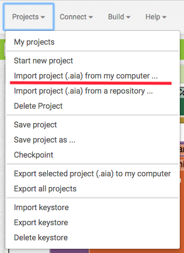

Importing Projects
==================

You can import someone else's project via an .aia file. Simply download the .aia file to your computer, and, in the menu, select ``Project > Import project (.aia) from my computer``.

After the project has finished importing, App Inventor will automatically load it as the current project.
