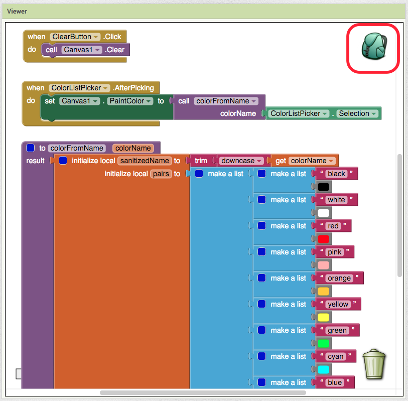

Canvas
======

Imagine that you are an app inventor living in Napperville, IL. You are friends with Adrienne, a local gypsy jazz musician. Adrienne recently released a new single called *Mustaches and Cat Eyes*. Like any forward-thinking indie musician, she decides to create a fun app to help promote her single.

Adrienne is an avid user of App Inventor and has already made a rudimentary
first version. Unfortunately, she needs to prepare for her upcoming tour
and doesn't have time to finish it. Download :download:`MustachesAndCatEyes.aia`
and :doc:`import the project into App Inventor </appendix/importing-projects/index>`.
After the imported project loads, the screen will look like this:

.. image:: canvas-designer.png

Run the app on your phone. Some blocks have already been added to this
project. If you click the "Take picture" button, the ``Camera`` will
take a picture and then set it as the background image of the
``Canvas``. If you drag your finger across ``Canvas``, black lines will
be drawn (this happens regardless of whether you took a picture or not).
However, this program is not yet complete! If you click on the Clear
button, nothing happens. That means that you can't afford to mess up when you're drawing the mustache, because you only have one chance to get it right!

.. exercise:: Add the blocks necessary to make it so that when the user clicks on the Clear button, whatever is drawn in the canvas is cleared.

Now your user can try as many times as she likes to draw the perfect mustache. But how do we bestow cat eyes upon the subject of the photo?

.. exercise:: Add some blocks so that when the user touches the canvas, a cat emoji is drawn at the point where she touched. Note that you will need to use the ``Canvas1.Touched`` block. Feel free to use this emoji: 😸

    .. exercisehint:: Emojis, despite being graphical in nature, still count as text.

    .. exercisehint:: The ``x`` and ``y`` input variables inside ``Canvas1.Touched`` represent coordinates.

Adrienne is pretty pleased that the Clear button works, but she tells you
that there are a whole bunch of cat face emojis, and she wants to be able to
choose which one to draw on the canvas. For this, you'll need to drag a ``ListPicker`` into your screen. Rename ``ListPicker1`` to ``CatListPicker`` and set its ElementsFromString field to::

  😸,😹,😺,😻,😼,😽,😾,😿,🙀

.. exercise:: Change your program so that when the user touches the canvas, the selected cat emoji is drawn.

  .. exercisehint:: Look for the property on ``CatListPicker`` that represents the text of the current selection.

Adrienne loves the new feature, and promptly sends you a picture of herself with 😻 as her right eye and 😽 for the left eye. But she tells you that you're not done yet, because she wants to be able to draw mustaches in other colors.

To solve the multicolor mustache problem, we need some kind of color
picker widget. Unfortunately, such a widget doesn't exist in App
Inventor. You can try implementing one on your own!

.. exercise:: Add another ``ListPicker`` called ``ColorListPicker`` to your screen. For now, set its ElementsFromString field to "black, red, green, blue". Add new blocks to your program so that after the user selects a color, she can drag on the Canvas to produce lines in that color.

  .. exercisehint:: You'll need to use ``ListPicker1.AfterPicking`` and ``Canvas1.PaintColor``.

  .. exercisehint:: You'll need to use ``else if`` blocks.

This is definitely a viable way to create a simple color picker, but if
you wanted to support all 13 basic colors in App Inventor you'd end up
with an ``if block`` that contains more than 70 blocks! If you did it as
a procedure (making it more reusable), it would look something like this:

.. image:: else-if-blocks.png

As usual, there's a better way to do it. Download :download:`ColorPicker.aia` and import it into App Inventor. This project implements a color picker that was made in a less obvious way, but is easier to work with in the long run:

.. image:: list-of-lists-blocks.png

As you can see, it's a procedure whose distinguishing feature is that it
uses a list of lists. It looks fatter than the previous procedure, but trust us, it uses far fewer blocks. Each sublist in the ``pairs`` list is actually a key-value pair. In other words, ``pairs`` is a lookup table. Conceptually, it's equivalent to a spreadsheet with two columns:

.. image:: spreadsheet.png

The ``look up in pairs`` block at the bottom of the procedure looks for
a key (left column) and returns the corresponding value in the same row
(right column). If the key is not found, then it returns whatever you
put in the ``notFound`` slot (in this case it's a ``black`` color
block).

So, this color picker seems decent enough, but it's in the wrong
project. You could just rebuild it block-for-block in the Canvas project
but that seems a bit laborious. This is the problem that the Backpack is
designed to solve! It's that thing in the upper right corner of the Blocks interface:

Drag the ``colorFromName`` procedure block and the ``ColorListPicker.AfterPicking`` block into the Backpack. Now, select My Projects from the menu and go back to the MustachesAndCatEyes project. In Blocks, drag both blocks from the Backpack into your project. Set the ElementsFromString field of ``ColorListPicker`` to::

  Black, White, Red, Pink, Orange, Yellow, Green, Cyan, Blue, Magenta, Light Gray, Gray, Dark Gray

Run your app to make sure that you can draw with all those different colors. Yay! Adrienne is happy with her app and it's a big hit (at least among the residents of Podunka). One day, your Aunt Sarah calls you up and says that she wants to draw a beige mustache on her cockerdoodle and could you please add beige as a color choice. A few hours later, you get a text from Puddles the cockerdoodle requesting the addition of turquoise.

.. exercise:: Add beige and turquoise to the color picker. Note that neither of these colors is built-in.

  .. exercisehint:: You can lookup RGB values for colors from `this page <http://www.w3schools.com/tags/ref_color_tryit.asp>`_.

Excellent! In this chapter, you learned about ``Canvas``, using lists of
lists as lookup tables, the Backpack feature, and how to use any color.
You've taken another step closer to becoming Master of the Universe!
