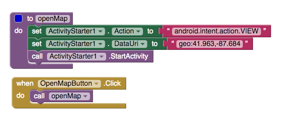
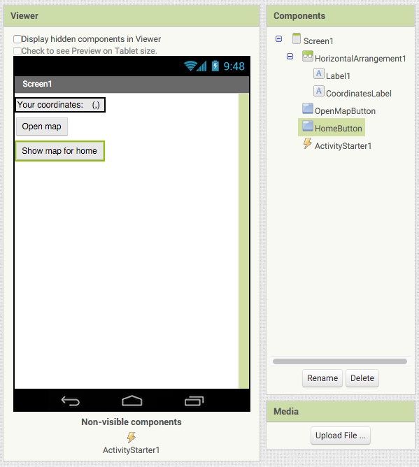
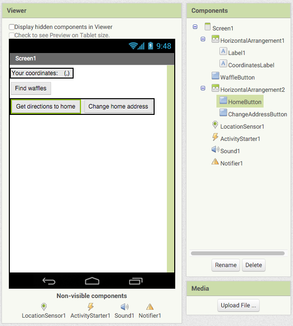
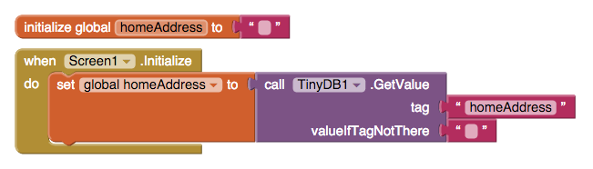

Location
========

Imagine that you are an app inventor living in MacEnrique, IL. Your housemate PJ has an interesting problem: whenever there's a full moon she turns into a werewolf and runs all over town terrorizing rabbits, squirrels, and other small animals. After a full night of being a werewolf, PJ usually wakes up in a random place with no memory of how she got there, along with a huge craving for waffles [#]_. Knowing that you're an app inventor, she asks you to make an app to help her out.

Download :download:`WerewolfAssistant.aia` and :doc:`import it into App Inventor </appendix/importing-projects/index>`. The screen will look like this:

.. image:: werewolf-assistant-screen.png

Drag a ``LocationSensor`` component from the Sensors section into the screen, and then add a ``LocationSensor1.LocationChanged`` block to your program. This block will be executed whenever ``LocationSensor1`` receives new location data. If your Android device does not have a SIM card, make sure to turn on the GPS or ``LocationSensor.LocationChanged`` will probably never be executed.

.. exercise:: Change the program so that whenever new location data is received, ``CoordinatesLabel`` will be updated with the latitude and longitude.

  .. exercisehint:: You will need to use a ``join`` block (found in Text group).

  .. exercisehint:: The ``join`` block can join as many text blocks as you want.

If you are doing this tutorial on a device that doesn't have a SIM card, it might take a pretty long time for your phone to get the location. Let's make your phone vibrate every time the location changes so you're not staring at your phone for a whole minute.

.. exercise:: Drag a ``Sound`` component into your screen in Designer. In Blocks, add a block so that your phone vibrates for a second when the location changes.

PJ thinks it's nice that the app shows her coordinates, but since she never knows where she is when she wakes up, what she really wants to see is a map. Of course, every smartphone has a map application, so App Inventor helpfully gives you the ability to open up and send data to an external map application.

Drag an ``ActivityStarter`` component into your screen. Then add these blocks to your program:

In the ``openMap`` procedure, you set the ``ActivityStart1.Action`` property to "android.intent.action.VIEW", which is a code that tells Android OS that we want to view something in another app. You set the ``ActivityStart1.DataUri`` property to a set of coordinates. Android OS expects a certain format for geographical data. For example::

  geo:41.963,-87.684

That is, the coordinate format is the text "geo:", followed by the latitude, followed by a comma, and ending with the longitude. Run the app to see that clicking the "Open map" button shows a map of the Ravenswood neighborhood of Chicago.

.. exercise:: Change the procedure ``openMap`` so that it can open a map to an arbitrary location. First, add two input blocks: ``latitude`` and ``longitude``. Second, make it so that ``ActivityStarter1.DataUri`` is set according to the values of ``latitude`` and ``longitude``.

  .. exercisehint:: You'll probably want to make use of global variables.

Run your app to see your current location on the map. Pretty sweet, huh?

PJ is pretty impressed with your app inventing skills, but she says she doesn't only want to know where she is, she also wants to know the closest waffle restaurants so that she can satiate her incredible hunger for waffles. Fortunately, you can add a keyword to geographical data. Like this::

  geo:41.963,-87.684?q=coffee

The above value would cause locations near (41.963, -87.684) that match the search term "coffee" to be marked on the map.

.. exercise:: Change your program so that clicking on the "Open Map" button shows a map with all the nearby waffle places marked.

  .. exercisehint:: Using the keyword "waffle" is probably sufficient. If you use "waffle house", that might exclude some breakfast places that serve waffles but aren't specifically waffle houses.

After PJ eats her fill of waffles, she wants to immediately go home so that she can take a shower. Fortunately, there is a way to show an arbitrary address on a map. The two most important blocks for doing this are ``LocationSensor.LatitudeFromAddress`` and ``LocationSensor.LongitudeFromAddress``.

Add a new button so that your screen now looks like this:

.. exercise:: Make it so that clicking ``HomeButton`` shows the map to PJ's house. You can use "4455 N Lincoln Ave, Chicago, IL" for the address, but feel free to use any address that you know exists.

PJ says the "Show map for home" button is fabulous, but wonders if you could make it show the directions instead of a plain map view. Luckily, there is a way to tell Android OS that you want directions to a particular address. You have to use a different format for the ``ActivityStarter.DataUri`` property, which will look something like this::

  google.navigation:q=4455+N+Lincoln+Ave,+Chicago,+IL&mode=w

The wrinkle to this format is that any space in the address has to be replaced with "+". Also, the "mode=w" indicates that we want walking directions [#]_.

.. exercise:: Change the text of ``HomeButton`` to "Directions to home" and modify your blocks so that clicking ``HomeButton`` shows the directions to PJ's home address.

Pj is a musician, and sometimes will go on tour for months at a time with her folk punk band [#]_. She needs the ability to change the home address in case she happens to be out of town when there's a full moon.

Add a new button whose text is "Change home address". Your screen should look like this:

.. exercise:: Change your program so that clicking ``ChangeAddressButton`` will call ``Notifier1.ShowTextDialog`` to ask the user to enter an address. Once you've filled out an address, clicking ``HomeButton`` should give you directions to the new address.

  .. exercisehint:: You'll need to add a new global variable to store the home address.

  .. exercisehint:: You'll need to add the ``Notifier.AfterTextInput`` block.

  .. exercisehint:: Remember to replace spaces with pluses.

Alright! Run the app again to see that changing the home address causes the directions to show a different starting point. However, there is a small problem. Refresh your app, and then see what happens when you click on ``HomeButton``. It didn't remember the new home address! Or maybe complained with the error "Can't find destination".

Variables only exist as long as an app is running. When you restart an app, all the variables are recreated from scratch. In order for your app to persist data, you must rely on a database. App Inventor provides a database in the form of the ``TinyDB`` component, available in the Storage group.

Drag a ``TinyDB`` into your screen and then  add these blocks to your program:

Your homeAddress global variable is initialized to "" but after the screen initializes it will be set to the value  returned by ``TinyDB1.GetValue``.

.. exercise:: Fix your program so that after you enter the address, the value gets stored in the database under the tag "homeAddress" so that it isn't lost when the app is closed.

  .. exercisehint:: You'll need to use the ``TinyDB1.SetValue`` block.

Subarashii! In this chapter, you learned about the `LocationSensor` component, how to open a map to your current location, how to open a map to an arbitrary address, how to display directions to an address, and how to use the TinyDb component. You are one step closer to becoming the Mikado of Zen!

Remember to use more footnotes!

.. rubric:: Footnotes

.. [#] "Post-transformation waffle hunger" is a well-documented phenomenon among lycanthropes.
.. [#] If you want driving directions, you would use "d". See `Google Maps Android API <https://developers.google.com/maps/documentation/android-api/intents>`_ for more details.
.. [#] The name of PJ's band is The Waffling Werewolves.
